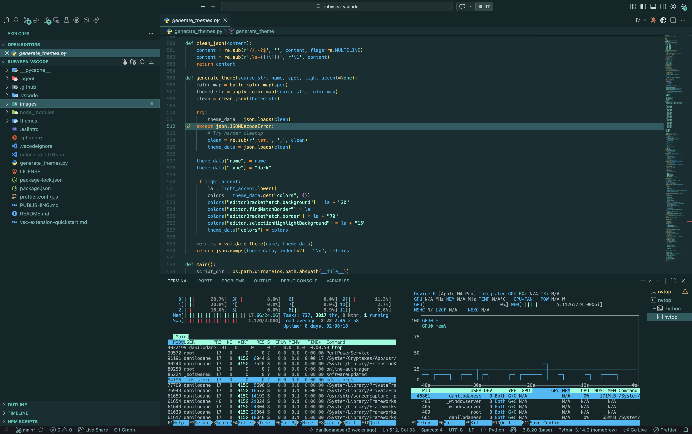
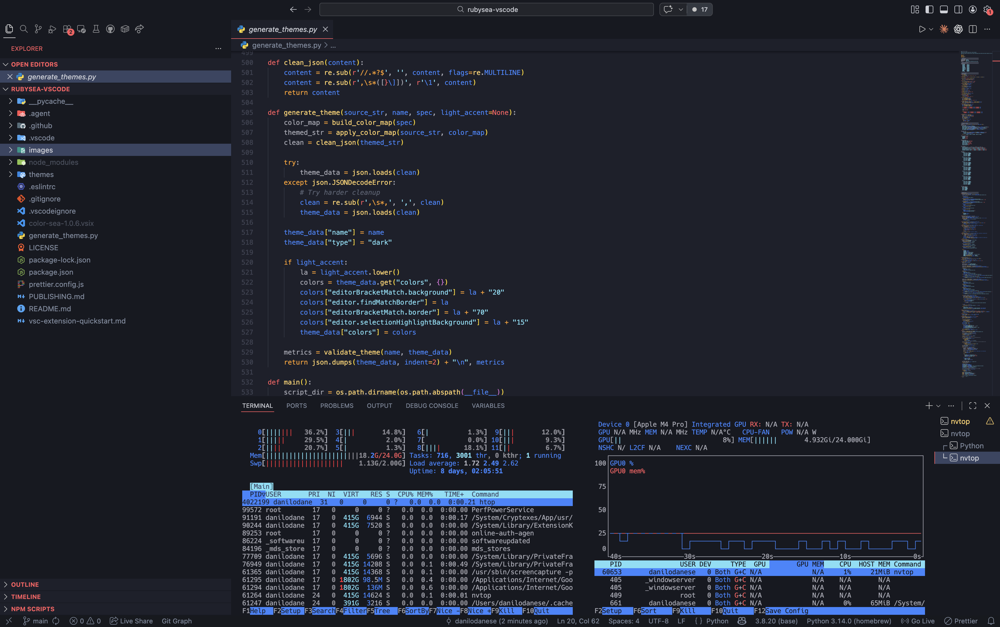
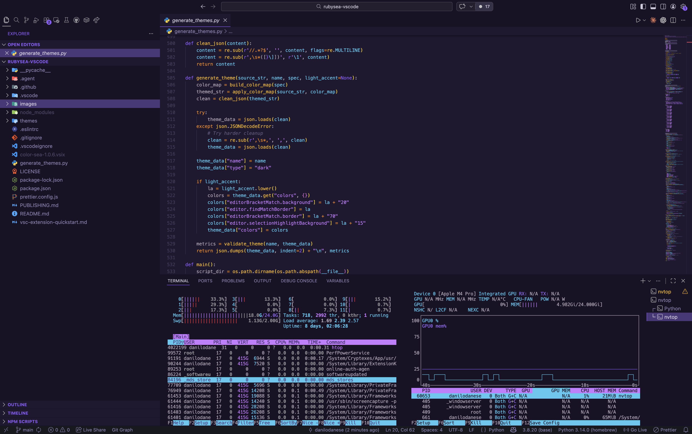
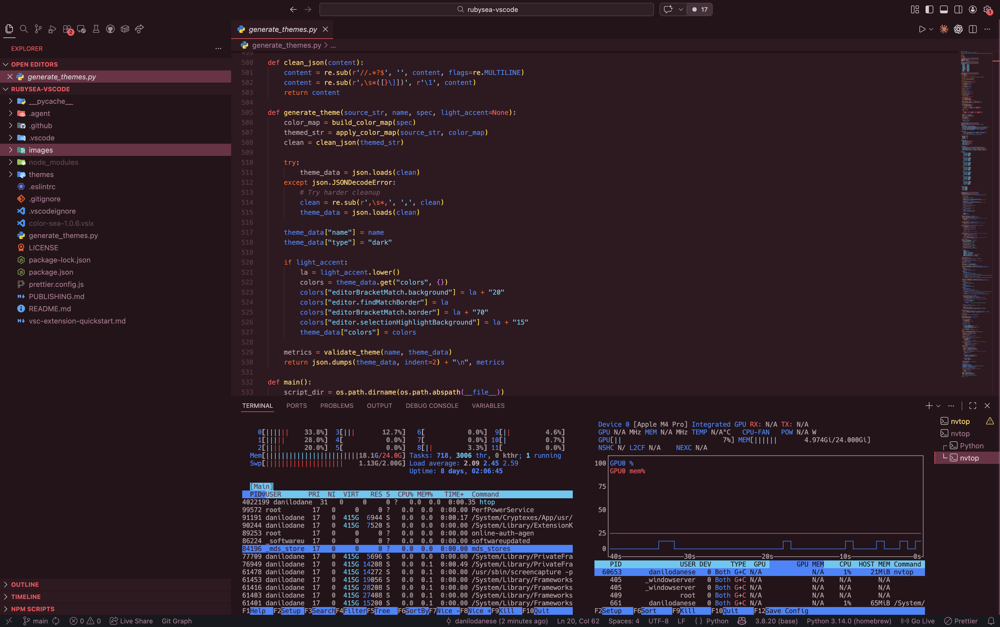
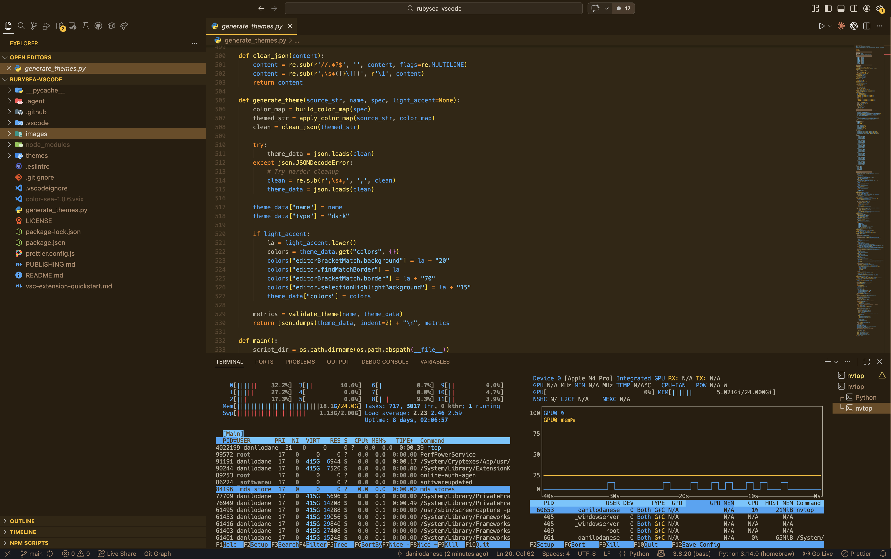
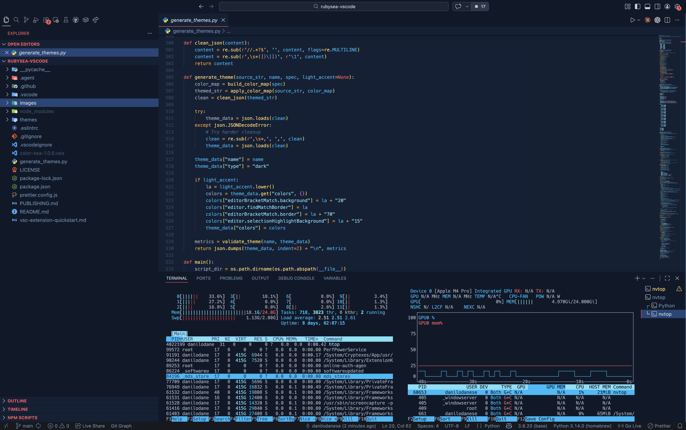

# Color Sea

Color Sea is a collection of seven dark VS Code themes built around a shared deep-surface system and bold accent families that stay readable during long sessions.

## Variants

- `Color Sea Orange`
- `Color Sea Red`
- `Color Sea Yellow`
- `Color Sea Purple`
- `Color Sea Green`
- `Color Sea Blue` -> inspired by `rubysea-vscode`
- `Color Sea Gray`

## Design Notes

- Shared structure: low-contrast UI surfaces, stronger editor selection layers, and a neutral text ladder derived from the editor background.
- Variant differences come from accent roles rather than from unstable background shifts.
- The palettes are intentionally vivid: hot reds and oranges, bright golds, electric blues, and luminous cyan highlights against calm dark surfaces.
- This release is published as a standalone theme set. The original source work comes from the MIT-licensed `rubysea-vscode` project by `barkerbg001`; the required attribution is preserved in `LICENSE`.

## Preview








## Marketplace Readiness

- Publisher: `danesed`
- Extension ID: `danesed.color-sea`
- Repository: `https://github.com/danesed/colorsea-vscode`
- License: MIT with preserved attribution in `LICENSE`

## Install Locally

```bash
npm install
npm run package:vsix
code --install-extension color-sea-1.0.0.vsix --force
```

Then open `Preferences: Color Theme` in VS Code and select one of the `Color Sea` variants.

## Development

- The source template lives in `themes/color-sea-template.json`.
- Generated themes live in `themes/color-sea-*.json`.
- Run `npm run generate:themes` after changing the generator or template.

